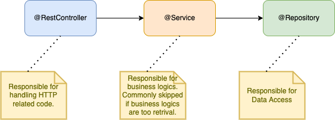

## Brief

### Preparation

Instructors' prior knowledge:
- Unit test in a DI Pattern framework requires the test to spin up a relevant test context before objects are able to injected via the `@Autowired` annotation.
- In this lesson, we will go through two types of unit test: `MockMvc` to test against the `@RestController` and simply `JUnit` to test against business logics in the `@Service` layer.

### Lesson Overview

Unit testings are commonly used for TDD approach. Unit Test aims to test the smallest unit of code in the application with its dependencies mocked. In this lesson, we will look at how we can test against the `@RestController` and simply `@Service` (child of `@Component` annotation).

---

## Self-studies check-in

**Q1: Are unit test and TDD both the same thing?**

A - Yes

B - No


**Q2: Which is NOT the benefit of writing unit tests?**

A - It prevent regression (breaking old feature while creating new feature).

B - It improves code quality by forcing developers to write loosely coupled testable code.

C - It makes the project size smaller.

D - It greatly reduces bugs.


**Q3: Which of the follow is NOT the way to write unit tests?**

A - Multiple tests are written against a single App code.

B - The amount of test code must always be written lesser than the App code.

C - You should always mock dependencies of the App Code.

D - Each test must always run independently.

> Test Code are codes you write to test against Application Code.
> Application Code (App Code) are the logics you write to develop a software.

---
## Part 1 - Scoping Unit Tests

The [Given-When-Then](https://en.wikipedia.org/wiki/Given-When-Then) approach is a good guide for us to scope test cases.

- GIVEN: The pre-conditions to the test.
- WHEN: Executing the test.
- THEN: The outcome 

### Short Exercise (Individual)

What are the test cases you might cover for a function like this?

```java
public boolean isExist(int productId){
    Optional<Product> product = prodRepo.findById(productId);

    return product.isPresent() ? true : false; // Shortform if-else statement
}
```
Shortform if-else statement [reference](https://www.w3schools.com/java/java_conditions_shorthand.asp).


|Given|When|Then|
|-----|----|----|
|Product ID exist|isExist() is called|return true|
|Learners input ...|||


---

## Part 2 - Maven Dependency Required

### Spring Simple Architecture Brief
A typical backend architecture for Spring Web looks like this:



- The `@RestController` classes are responsible for handling the Requests and Responses of the HTTP Endpoint.
- The `@Service` classes contain business logics. They are not mandatory but recommended when business logics get complicated. 
- The `@Repository` interfaces that implements `JpaRepository` are responsible for handling data access.

A simple endpoint that check if a product exist basically do not need a `@Service` class.

A payment process that linked to inventory update and shipping request would use the `@Service` classes.

### Testing Approach

There are two approaches of testing we will be exploring in the next 1 hour. The first approach is the use of MockMvc and the other is JUnit, both references are listed in learners' self study materials under "Helpful Links".

The MockMvc approach is typically used for testing the `@RestController` layer by mock firing HTTP Requests. The database `Repository` layer shall be mocked to eliminate the need for real data.

The JUnit approach is typically used for testing the `@Service` layer. `@Service` is a child of `@Component`, used for containing complex business logics. In such a case, the use of JUnit will be testing against the business logics. 

### The pom.xml file

Spring Boot comes with tester starter dependency. But we have to exclude JUnit 4 because we are using JUnit 5. Add the `<exclusions>` to the current `spring-boot-starter-test` dependency. If the entire dependency is not present, add the entire block of code below.

The MockMvc library is included in the `spring-boot-starter-test` so you do not have to add this explicitly.

```xml
<dependency>
    <groupId>org.springframework.boot</groupId>
    <artifactId>spring-boot-starter-test</artifactId>
    <scope>test</scope>
    
    <!-- exclude junit 4 -->
    <exclusions>
        <exclusion>
            <groupId>junit</groupId>
            <artifactId>junit</artifactId>
        </exclusion>
    </exclusions>
</dependency>
```

Since spring boot v2.4.0 onwards, JUnit 5 is automatically included in the `spring-boot-starter-test`. You should be using spring boot version >2.6.0 in this program.

---

## Part 3 - MockMVC Test

In this part, we will be running tests against the `CatalogueController.java` class that is annotated with `@RestController`. Yet, mocking the data layer, namely `CatalogueRepository.java` that is annotated with `@Repository`.

Before we start writing Test code, let's observe the project [src](./src/shoppingcartapi/src/) folder. There are `main` and `test` folders. The `main` folder contains Application Code (App Code) while the `test` folder contains (Test Code). The folder structure between the `main` and `test` folder are similar. 

Let's start with the `CatalogueControllerTest.java` file located [here](./src/shoppingcartapi/src/test/java/com/skillsunion/shoppingcartapi/controller/CatalogueControllerTest.java).

Step 1: Annotate the class with `@WebMvcTest`.

```java
@WebMvcTest(CatalogueController.class)
public class CatalogueControllerTest {
```

Step 2: Define the possible test cases with the Given-When-Then approach. Let's look at a simple `get` method from the App Code [CatalogueController.java](./src/shoppingcartapi/src/main/java/com/skillsunion/shoppingcartapi/controller/CatalogueController.java)

```java
@GetMapping(value = "/catalogues/{id}")
public ResponseEntity<Optional<Catalogue>> get(@PathVariable int id){
    Optional<Catalogue> result = (Optional<Catalogue>) repo.findById(id);
    if(result.isPresent()) return ResponseEntity.ok(result);
    
    return ResponseEntity.notFound().build();
}
```
|Scenario #|Given|When|Then|
|-|-----|----|----|
|1|Catalogue Id is not found|method is called|return status 404 not found|
|2|Catalogue Id is present|method is called|return status 200 ok and response body|
|3|Database connection is lost|method is called|return 500 status internal server error|

Step 3: Let's write test case for scenario #1.

```java
@Test
public void givenNoDataExist_whenFetchById_thenReturnNotFound() throws Exception {
        
    int mockId = 1; // mock path variable

    // mock repository layer
    Optional<Catalogue> catalogue = Optional.empty();
    when(mockRepo.findById(mockId)).thenReturn(catalogue);
    
    // call the method
    this.mockMvc.perform(get("/catalogues/"+mockId)).andDo(print()).andExpect(status().isNotFound());    
}
```

> Get ready to resolve dependencies issues

Step 4: Run test on terminal

Run `./mvnw test` on Terminal. Ensure that you are on the same directory as `pom.xml`.

If you change `status().isNotFound()` to something else, the test should fail.

---

## Part 4 - JUnit Test

In this part, we will focus on testing against business logic.The business logics are typically written in the classes annotated with `@Service`. The `@Service` annotation is a child of `@Component`. 

We will be writing Test Code against [ServiceForTest.java](./src/shoppingcartapi/src/main/java/com/skillsunion/shoppingcartapi/service/ServiceForTest.java).

Let's start writing Test Code for [TestServiceForTest.java](./src/shoppingcartapi/src/test/java/com/skillsunion/shoppingcartapi/service/TestServiceForTest.java).

Step 1: Annotate the class with `@SpringBootTest`.

Step 2: Define the possible test cases with the Given-When-Then approach. Let's look at a simple `verifyPassword` method from the App Code [ServiceForTest.java](./src/shoppingcartapi/src/test/java/com/skillsunion/shoppingcartapi/service/TestServiceForTest.java)

```java
public int verifyPassword(String password) throws Exception{
		
    if(password.length() < 8) {
        throw new Exception("Password must be at least 8 characters");
    }else {
        return password.length();
    }
    
}
```
|Scenario #|Given|When|Then|
|-|-----|----|----|
|1|Password length is 8|method is called|return 8|
|2|Password length is 9|method is called|return 9|
|3|Password length is 7|method is called|throws exception|

Step 3: Let's write Test Code for scenario #1

```java
@Test
public void givenPasswordWithLengthEight_whenMethodIsCalled_thenReturnIntEight() throws Exception {
    String password = "long password";
    int length = service.verifyPassword(password);
    assertEquals(password.length(), length);
}
```
> Get ready to resolve dependencies issues

Step 4: Run test on terminal

Run `./mvnw test` on Terminal. Ensure that you are on the same directory as `pom.xml`.


End.